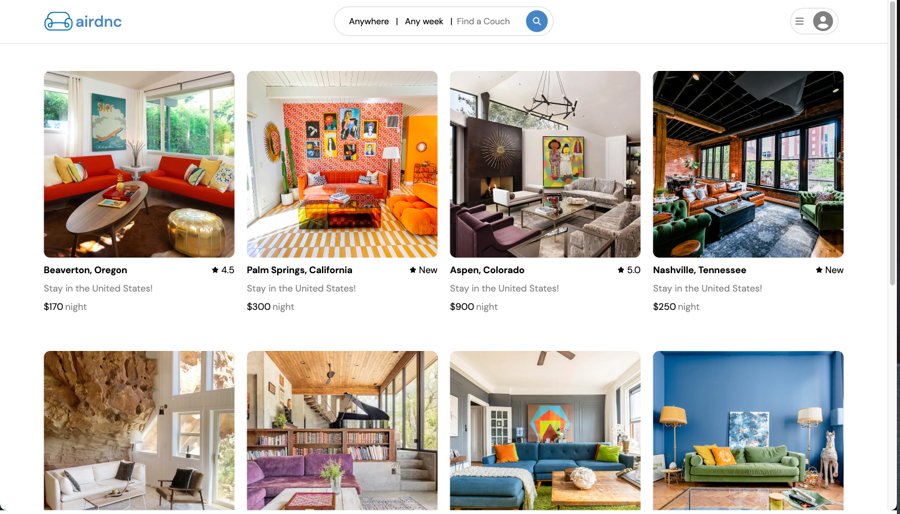
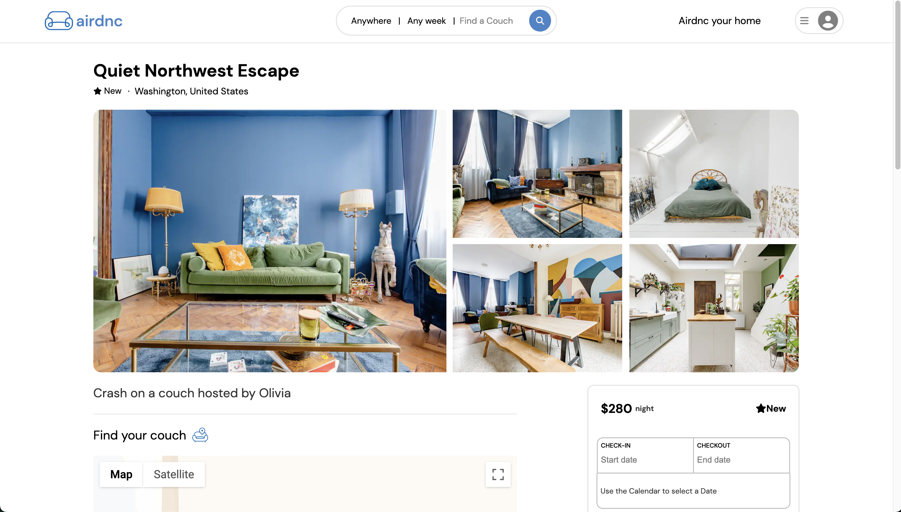

  <h1>
  <a href="https://airdnc.onrender.com/">Airdnc  </a>
  </h1>

 
  

## Why have Breakfast in Bed when you can have Dinner on a Couch?

- Introducing Airdnc, my Airbnb clone! A web application that leverages the power of React, Redux, Google Maps API, and Express to offer a seamless and intuitive experience for property owners and travelers alike. 

- Built using the latest web technologies and best practices, my application provides an easy-to-use interface that allows users to list properties, book rentals, and leave reviews. With React at its core, Airdnc offers lightning-fast performance and real-time updates, ensuring that users can access the most up-to-date information on their properties. 

- I had the pleasure of collaborating with <a href="https://www.linkedin.com/in/mario-menitra/">Mario Menitra</a>, a skilled UI/UX designer who designed logos and curated a color scheme that captured my vision for the site. The culmination of our collaborative efforts resulted in a unique playful twist of Airbnb's aesthetics.

- Redux was utilized to handle state management, providing a predictable and centralized way to manage how data flows within the application. Moreover, Express was used to create a scalable and efficient backend API that seamlessly integrates with the frontend and allows for easy communication with external services. I hope you enjoy Airdnc!

  

 
 

  

- The Home page displays all available properties.

- Each card features a preview image and information about the spot.

- The homepage has a staggered loading animation and preview image zoom animations on hover. 

- Clicking a display card directs to the full listing page.

 

<h2 align="center">Airdnc Core <a href="https://github.com/StevenBradleyA/airdnc/wiki/Feature-List">Features</a></h2>

- Full CRUD Spots
- Full CRUD Reviews
- Full CRUD Bookings
- Google Maps API

<h2 align="center">Future Implementation Goals</h2>

- Spot search feature
- User wishlists

<h2 align="center">Connect with me </h2>

